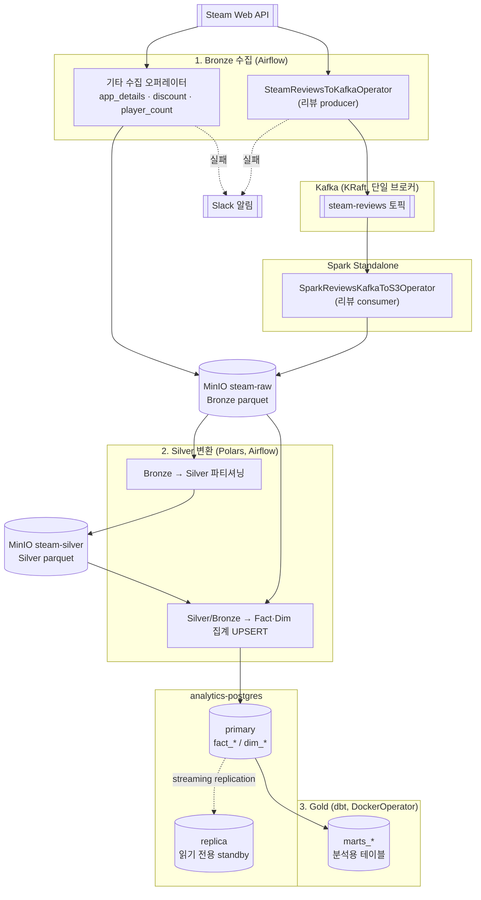

# Steam 게임 분석 프로젝트

## 아키텍처



**읽는 법**
- **Bronze 수집**: 리뷰를 제외한 데이터(게임 상세, 할인, 동접자)는 Steam API → MinIO(steam-raw)로 직접 저장. 리뷰만 producer-consumer 구조라 Kafka를 거침 (기존 in-memory `queue.Queue` 연결을 실제 MQ로 대체한 것 — 저장 방식·경로는 기존과 동일).
- **Kafka+Spark**: `SteamReviewsToKafkaOperator`가 발행하고, `SparkReviewsKafkaToS3Operator`(Spark Structured Streaming, `trigger(availableNow=True)`)가 소비해서 동일한 Bronze 구조로 저장. Spark job 실행 시점에만 클러스터를 쓰고 상시 스트리밍 서비스는 아님.
- **Silver 변환**: Polars 기반 오퍼레이터가 Bronze parquet을 정제해 Silver parquet으로 파티셔닝하거나, 곧바로 `fact_*`/`dim_*` 테이블로 집계·UPSERT.
- **DB 이중화**: `analytics-postgres`(primary)를 `analytics-postgres-replica`가 스트리밍 복제로 계속 추적. 자동 failover는 없고 수동 대응 절차는 [`DB_FAILOVER_RUNBOOK.txt`](DB_FAILOVER_RUNBOOK.txt) 참고.
- **Gold**: dbt가 `DockerOperator`로 별도 컨테이너에서 실행되어 staging 뷰 → marts 테이블 빌드.


## 프로젝트 구조

```
steam-project/
├── docker-compose-local.yml     # 전체 인프라 정의
├── .env                         # 실제 환경변수 (git 제외)
├── airflow/
│   └── Dockerfile               # Airflow 커스텀 이미지 (JDK 17 + Python 3.10, pyspark용)
├── dbt/
│   ├── Dockerfile                # dbt 실행용 이미지 (DockerOperator가 참조)
│   └── steam_dbt/                # staging / marts 모델
├── init-db/                     # 분석DB 초기 테이블 스키마
├── init-db-replication/         # DB 복제 설정 스크립트 (primary/replica)
├── dags/                        # Airflow DAG 파일들
├── plugins/
│   ├── hooks/                   # S3, Postgres, Spark, Kafka 등 커넥션 Hook
│   └── operators/                # 비즈니스 로직 오퍼레이터
├── tests/
│   ├── plugins/operators/       # 유닛 테스트 (mock 기반)
│   └── integration/              # 통합 테스트 (실제 서비스 연동, -m integration)
├── scripts/                     # 유틸리티 스크립트
├── logs/                        # Airflow 로그
└── DB_FAILOVER_RUNBOOK.txt      # DB 장애 수동 대응 절차
```

## 컨테이너 구성

| 컨테이너 | 역할 | 포트 | 접속 정보 |
|-----------|------|------|-----------|
| airflow-webserver | Airflow UI | localhost:8080 | admin / admin |
| airflow-scheduler | DAG 실행 (LocalExecutor) | - | - |
| airflow-postgres | Airflow 메타DB | localhost:5433 | airflow / airflow |
| analytics-postgres | 분석용 DB (primary) | localhost:5434 | analytics / analytics |
| analytics-postgres-replica | 분석용 DB 복제본 (읽기 전용) | localhost:5435 | analytics / analytics |
| minio | S3 대체 스토리지 | localhost:9000 (API), localhost:9001 (콘솔) | minioadmin / minioadmin |
| kafka | 메시지 브로커 (KRaft) | localhost:9094 (외부용) | - |
| spark-master | Spark 클러스터 마스터 | localhost:7077 (제출), localhost:8081 (UI) | - |
| spark-worker-1 | Spark 워커 (2 core / 2GB) | localhost:8082 (UI) | - |
| spark-worker-2 | Spark 워커 (2 core / 2GB) | localhost:8083 (UI) | - |

## 실행 방법

### 1. 환경변수 설정
```bash
cp .env.example .env
# .env 파일을 열고 STEAM_API_KEY, SLACK_WEBHOOK_URL, REPLICATOR_PASSWORD 입력
```

### 2. 컨테이너 실행
```bash
# 최초 실행 (초기화 포함)
docker compose -f docker-compose-local.yml up airflow-init
docker compose -f docker-compose-local.yml up -d

# 상태 확인
docker compose -f docker-compose-local.yml ps
```

### 3. 접속 확인
- Airflow UI: http://localhost:8080 (admin / admin)
- MinIO 콘솔: http://localhost:9001 (minioadmin / minioadmin)
- Spark Master UI: http://localhost:8081
- 분석DB 접속: `psql -h localhost -p 5434 -U analytics -d steam_analytics`

### 4. 종료
```bash
docker compose -f docker-compose-local.yml down          # 컨테이너만 종료 (데이터 유지)
docker compose -f docker-compose-local.yml down -v        # 컨테이너 + 볼륨 삭제 (데이터 초기화)
```

### 5. 테스트
```bash
# 유닛 테스트 (로컬 venv, mock 기반)
pytest -v

# 통합 테스트 (컨테이너 안에서, 실제 서비스 연동)
docker exec -e PYTHONPATH=/opt/airflow/plugins airflow-scheduler pytest /opt/airflow/tests/integration -m integration -v
```

## AWS 전환 시 변경 포인트

| 로컬 | AWS | 변경 내용 |
|------|-----|-----------|
| MinIO | S3 | endpoint_url만 제거하면 됨 |
| analytics-postgres | Snowflake / Redshift | Connection string 변경 |
| LocalExecutor | CeleryExecutor 또는 ECS | 스케일 필요 시 |
| Kafka (단일 브로커) | MSK | 브로커 다중화 필요 시 |
| Spark Standalone | EMR | 클러스터 매니저만 교체, job 코드는 그대로 |
